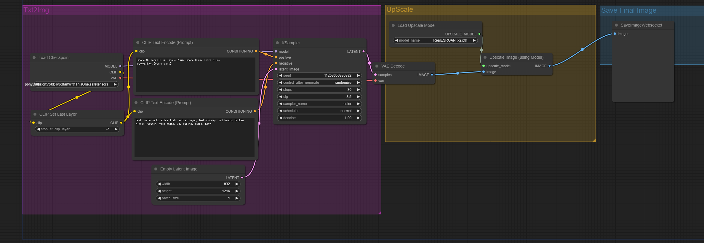

# Pony Diffusion V6 XL Basic

## LandScape(3:2 [2432 × 1664])


## Portait(2:3 [1664 x 2432])



## Setup
- Python 3.12.3
```bash
cd ComfyUI
pip install -r requirements.txt
pip install websocket-client

cd models/checkpoints
wget https://civitai.com/api/download/models/290640?token=xxxxxxxxx --content-disposition
--relative-path

cd models/upscale_models
wget https://huggingface.co/ai-forever/Real-ESRGAN/resolve/main/RealESRGAN_x2.pth
```

## Example
### LandScape
```bash
time python websockets_api.py --mode 1 --prompt "
cute angel" --save_path "./test.png"
```
```
NVIDIA L4
real    0m25.163s
user    0m2.713s
sys     0m0.036s
```
### Portait
```bash
time python websockets_api.py --mode 2 --prompt "
cute angel" --save_path "./test.png"
```
```
NVIDIA L4
real    0m23.289s
user    0m2.660s
sys     0m0.024s
```
